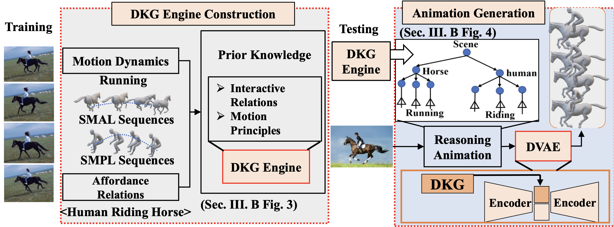

# Automatic-Generation-of-3D-Scene-Animation
Code and Dataset for Automatic Generation of 3D Scene Animation Based on Dynamic Knowledge Graphs and Contextual Encoding

<div align="center">
  
</div>

## Reproduction

We recomend you to setup in the following steps:

1. Clone the repo.
```
git clone https://github.com/ZxyLinkstart/Automatic-Generation-of-3D-Scene-Animation.git
```

2. Create conda environment
```
conda env create -f environment.yml
conda activate AG3D
```

3. Download the "The Web-collected Animation Dataset (WCAD)"

If you want to request a dataset please fill out the "[The Web-collected Animation Dataset Release Agreement](https://github.com/ZxyLinkstart/Automatic-Generation-of-3D-Scene-Animation/blob/main/Web-collected%20Animation%20Dataset%20Release%20Agreement.pdf)", send the email to songwenfenga@gmail.com.

## We will upload the pre-trained models.
